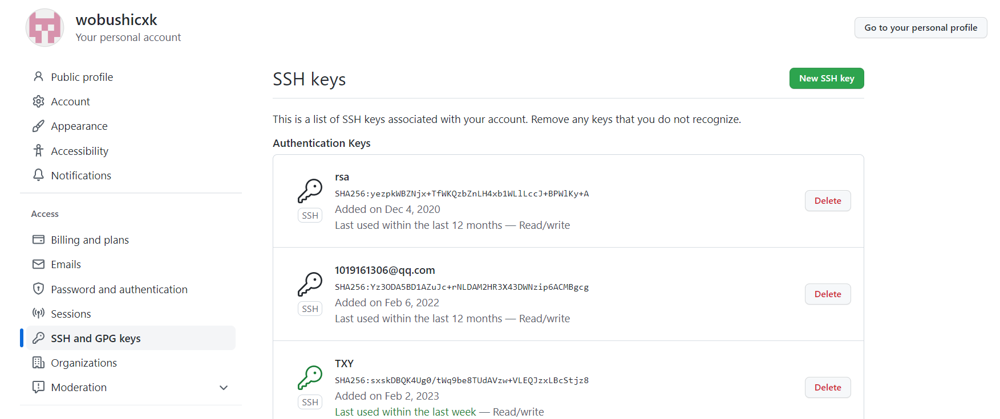
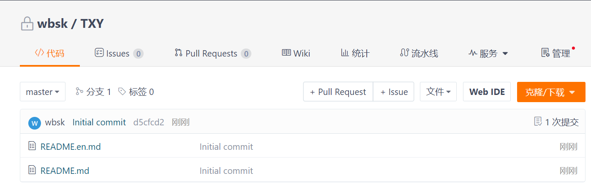
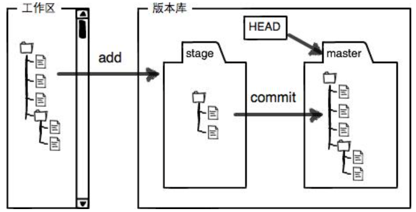

#远程仓库
**协议：** SSH和HTTPS。
- SSH操作远程仓库：需要使用公钥和私钥对来做权限的认证。
- HTTPS操作远程仓库：需要使用账号密码来做权限的认证。

#配置邮箱和用户名
**作用**
设置用户名和邮箱，用于从本地仓库向远程仓库提交记录时，在远程仓库记录下这些操作是由谁来完成的。

**配置**
```shell
git config --global user.name "ZXW"
git config --global user.email "ZXW@email.com"
#查看配置列表
git config --list
```

#配置SSH连接
**本地生成公私钥对**
```shell
[root@txy1 .ssh]# ssh-keygen -t rsa -C "ZXW@email.com"
Generating public/private rsa key pair.
Enter file in which to save the key (/root/.ssh/id_rsa): 
Enter passphrase (empty for no passphrase): 
Enter same passphrase again: 
Your identification has been saved in /root/.ssh/id_rsa.
Your public key has been saved in /root/.ssh/id_rsa.pub.
The key fingerprint is:
SHA256:sxskDBQK4Ug0/tWq9be8TUdAVzw+VLEQJzxLBcStjz8 ZXW@email.com
The key's randomart image is:
+---[RSA 2048]----+
|+=  o.     .+BB=+|
|=..o  .   . .=+=.|
|.o. .. .   .. *..|
|  . .o.     .o o |
|   . oo S    .o .|
|    o .o o  .. . |
|   .   .o. . ..  |
|        oo+ .  E |
|        .+..    .|
+----[SHA256]-----+

[root@txy1 .ssh]# ls
id_rsa  id_rsa.pub

[root@txy1 .ssh]# cat id_rsa.pub 
ssh-rsa AAAAB3NzaC1yc2EAAAADAQABAAABAQC7j6L0LmN7Xqj6cY6CWHiQI9LURlBVxAqFtaVSLPILJuAjDqUXo8z8SE896NGgjpRYki+gSdvYJSaG6mOSRbaU/66u9ChepDjsrULI6yP6q58XiSx+Cz+zpO/TC89mSQqSLOHXKZUFo7PUGeqxn9Z0uvPs9H2S/w3FbD5RRKKmo973lmMx0ymsIdeXi4znoujRx4dhcONaeW3YbdBS8ed5jh14cRbllkOhlaEIXESgyTPVx2HsmxZFWsMuiwnlRKzqHCmtSPNlxOTv8l3WQ5o+0TLkA4pkMWIVtFEEoFOw6nzui+UjolnSeDfjUsZiniM/boT5gTIuyq5jkP4ztS+F ZXW@email.com
```
**在远程仓库中保存**


#远程连接
**github新建仓库**


**连接仓库**

1、remote连接
```shell
#当前连接仓库
[root@txy1 mytest]# git remote -v
origin	git@github.com:wobushicxk/mytest.git (fetch)
origin	git@github.com:wobushicxk/mytest.git (push)
[root@txy1 mytest]# git remote add origin git@github.com:wobushicxk/mytest.git
fatal: remote origin already exists.
```
2、clone连接
```shell
git clone git@github.com:wobushicxk/mytest.git
```

#正常流程
**修改 -> add -> commit -> push**
```shell
[root@txy1 mytest]# vi test.txt 
[root@txy1 mytest]# git add test.txt 
[root@txy1 mytest]# git status
# On branch main
# Changes to be committed:
#   (use "git reset HEAD <file>..." to unstage)
#
#	modified:   test.txt
#
[root@txy1 mytest]# git commit -m "wrong version"
[main f052d04] wrong version
 1 file changed, 1 insertion(+)
[root@txy1 mytest]# git push origin main
```
**git push -u origin master**

加了参数-u后，以后即可直接用`git push`代替`git push origin master`。

#回退
###add与commit的区别

- add将修改放到暂存区。
- commit将修改放到可push区，可称为版本区。

**场景**
- 第一次修改 -> `git add` -> `git commit` 
- 第二次修改 -> `git add` -> `git commit` -> `git push`

第一次修改被放入版本区，准备push。
第二次修改并没有放入版本区，所以push只负责把版本区的修改提交。

###工作区回退(最近一次)
```shell
git checkout -- readme.txt
```
在工作区的修改全部撤销,让文件回退到最近一次`git commit`或`git add`时的状态。这里有两种情况：
- 一种是readme.txt自修改后还没有被放到暂存区，现在，撤销修改就回到和版本库一模一样的状态；
- 一种是readme.txt已经添加到暂存区后，又作了修改，现在，撤销修改就回到添加到暂存区后的状态。
###工作区回退（特定版本）
```shell
#查看版本区信息
git log
#上一个版本就是HEAD^，多个写成HEAD~100
git reset --hard HEAD^
#使用标签回退
git reset --hard 1094a
```
**例子**
```shell
[root@txy1 mytest]# git log
commit aa4931a668e7ce916ad4948219256f19b8e25ef0
Author: ZXW <ZXW@email.com>
Date:   Thu Feb 2 15:48:56 2023 +0800

    i dont want
commit 9f8107b77795fac5e7d7aaef253ffd9c3291b78a
Author: ZXW <ZXW@email.com>
Date:   Thu Feb 2 15:40:32 2023 +0800

    can we?

[root@txy1 mytest]# git reset --hard HEAD^
HEAD is now at 9f8107b can we?

[root@txy1 mytest]# git reset --hard aa493
HEAD is now at aa4931a i dont want
```
###文件对比
```shell
git diff HEAD -- readme.txt
```
查看工作区和版本库里面最新版本的区别

#分支管理
**基本操作**
- git branch 命令查看当前分支 
- git branch dev 创建dev分支
- git checkout dev 切换到dev分支
- git checkout -b dev 创建dev分支，然后切换到dev分支 
*----在main分支的修改不会影响tmp分支的内容----*

#远程与本地版本冲突
###git pull
```shell
git pull --rebase origin main
```
在修改本地代码前，先使用git pull拉取远程最新代码，然后再进行修改（推荐--rebase）
--rebase 
###force
```shell
git push --force 远程仓库名 远程分支名
```
强制修改远程的仓库
```shell
#回退到旧版本
[root@txy1 mytest]# git reset --hard HEAD^^
HEAD is now at 9f8107b can we?
[root@txy1 mytest]# vi test.txt 
[root@txy1 mytest]# git add .
[root@txy1 mytest]# git commit -m "old version and change"
[main 4c6f4a4] old version and change
 1 file changed, 1 insertion(+)
#此时push会报错
[root@txy1 mytest]# git push origin main
To git@github.com:wobushicxk/mytest.git
 ! [rejected]        main -> main (non-fast-forward)
error: failed to push some refs to 'git@github.com:wobushicxk/mytest.git'
hint: Updates were rejected because the tip of your current branch is behind
hint: its remote counterpart. Merge the remote changes (e.g. 'git pull')
hint: before pushing again.
hint: See the 'Note about fast-forwards' in 'git push --help' for details.

#pull远程版本进行对比
[root@txy1 mytest]# git pull --rebase origin main
From github.com:wobushicxk/mytest
 * branch            main       -> FETCH_HEAD
First, rewinding head to replay your work on top of it...
Applying: old version and change
Using index info to reconstruct a base tree...
M	test.txt
Falling back to patching base and 3-way merge...
Auto-merging test.txt
CONFLICT (content): Merge conflict in test.txt
Failed to merge in the changes.
Patch failed at 0001 old version and change
The copy of the patch that failed is found in:
   /gitdata/mytest/.git/rebase-apply/patch

When you have resolved this problem, run "git rebase --continue".
If you prefer to skip this patch, run "git rebase --skip" instead.
To check out the original branch and stop rebasing, run "git rebase --abort".
[root@txy1 mytest]# git status
# HEAD detached at 85fe1f8
# You are currently rebasing branch 'main' on '85fe1f8'.
#   (fix conflicts and then run "git rebase --continue")
#   (use "git rebase --skip" to skip this patch)
#   (use "git rebase --abort" to check out the original branch)
#
# Unmerged paths:
#   (use "git reset HEAD <file>..." to unstage)
#   (use "git add <file>..." to mark resolution)
#
#	both modified:      test.txt
#
no changes added to commit (use "git add" and/or "git commit -a")

#文件当中显示出不同之处
[root@txy1 mytest]# cat test.txt 
by 2023.2.2-ZXW
for covering wrong version
<<<<<<< HEAD
=======
main change push tmp
old but change
>>>>>>> old version and change

#确认后再次提交
[root@txy1 mytest]# git add .
[root@txy1 mytest]# git rebase --continue
Applying: old version and change
[root@txy1 mytest]# git push origin main
Counting objects: 5, done.
Delta compression using up to 2 threads.
Compressing objects: 100% (3/3), done.
Writing objects: 100% (3/3), 368 bytes | 0 bytes/s, done.
Total 3 (delta 1), reused 0 (delta 0)
remote: Resolving deltas: 100% (1/1), completed with 1 local object.
To git@github.com:wobushicxk/mytest.git
   85fe1f8..cb2c5b3  main -> main
```

